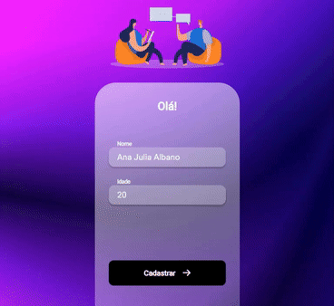

# Register App

Projeto desenvolvido em React.js consumindo API em Node.js . A aplicação traz a funcionalidade de cadastrar um usuário, permite também excluir os usuários e navegar entre páginas.

## Scripts disponíveis

No diretório do projeto, você pode executar: `npm start` ou `yarn start`, para executar o aplicativo no modo de desenvolvimento.
\
Abra [http://localhost:3000](http://localhost:3000) para visualizá-lo em seu navegador.

### Deployment

Acesse o deploy da aplicação online: [https://register-app-aj.netlify.app/](https://register-app-aj.netlify.app/)

## Burguer App

## Tecnologias

- React
- Styled components
- Node
- Axios
- Git and Github
- Netlify
